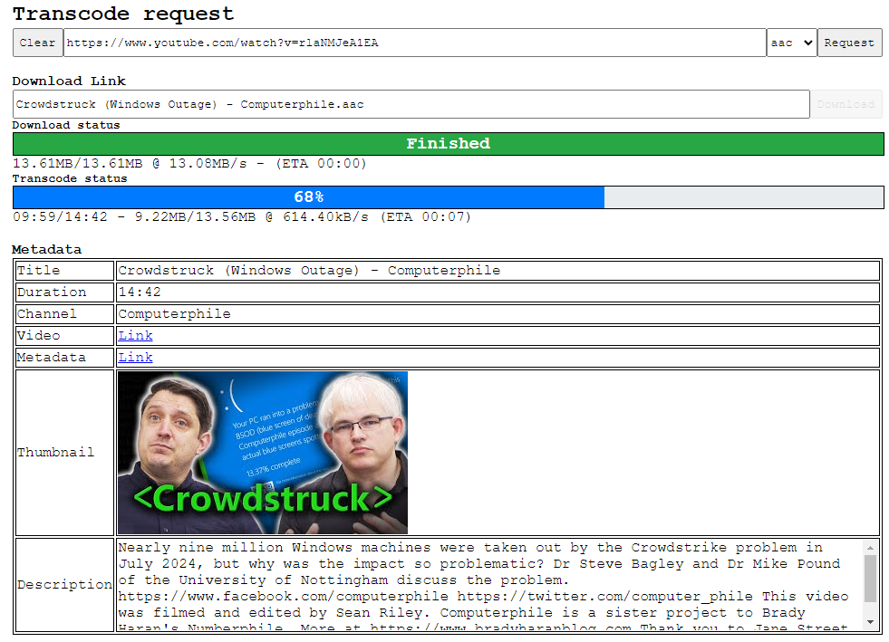

# Introduction
[](https://github.com/williamyang98/ytdlp_webui/actions/workflows/x86-windows.yml)

Download and convert Youtube videos into audio clips. Has a web UI client that wraps around ```yt-dlp``` and ```ffmpeg``` and caches downloaded and transcoded files locally.

## Usage
1. Start the server: ```ytdlp_server --url 127.0.0.1 --port 8080```.
2. Access the webpage with your browser: ```http://localhost:8080```.
3. Copy and paste video link into URL bar.
4. Press ```Request``` button.
5. Wait for download and trancode to finish.
6. Press ```Download``` button to get audio clip.

## Gallery


## Building
1. Download rust.
2. Download ffmpeg and yt-dlp using ```./scripts/download_win32.sh``` or links for your platform.
3. Build server: ```cargo build -r```
4. Run server: ```cargo run -r```
