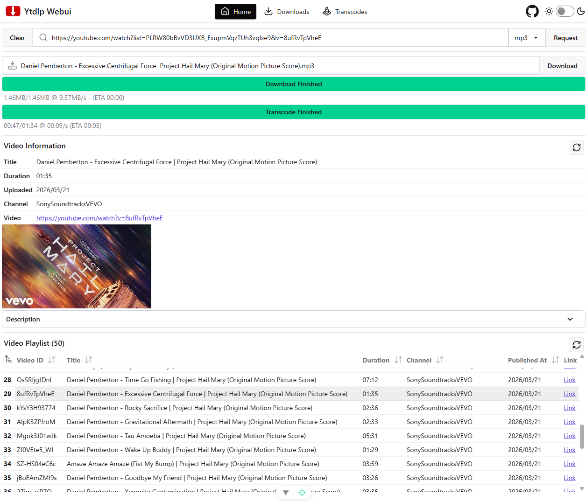

# Introduction
[](https://github.com/williamyang98/ytdlp_webui/actions/workflows/x86-windows.yml)
[](https://github.com/williamyang98/ytdlp_webui/actions/workflows/x86-linux.yml)

Download and convert Youtube videos into audio clips. Has a web UI client that wraps around ```yt-dlp``` and ```ffmpeg``` and caches downloaded and transcoded files locally.

## Usage
1. Start the server: ```server --url 127.0.0.1 --port 8080```.
2. Access the webpage with your browser: ```http://localhost:8080```.
3. Copy and paste video link into URL bar.
4. Press ```Request``` button.
5. Wait for download and trancode to finish.
6. Press ```Download``` button to get audio clip.

## Gallery


## Building from source
1. Download rust
2. Download packages using ```./scripts/download_*.sh``` for your platform if required
3. Build programs: ```cargo build -r```
4. Download binaries: ```cargo run -r --bin cli```
5. Copy environment file ```./scripts/.env_*``` for your platform and rename it to ```.env``` in the root folder

## Running server
- Run server: ```cargo run -r --bin server```
- Update binaries: ```cargo run -r --bin cli```
